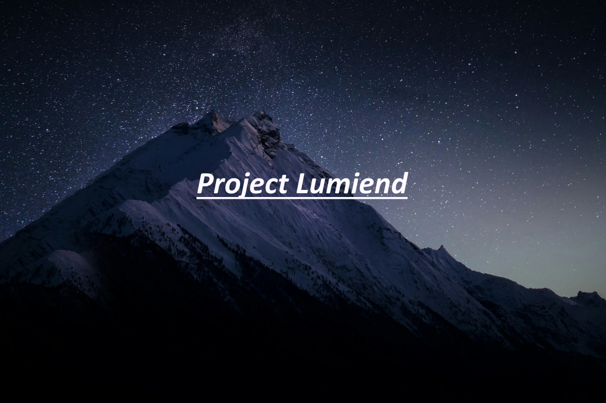

_________________________________________________________________________________________________________________________
# Project Lumiend Website:
Was made by: secret_pommes#9437 for the Project Lumiend API
What is Project Lumiend:
Project Lumiend is a API / server to visit old Fortnite Seasons.
more infos on the discord server.

-Discord Server to try the Project:
http://dsc.gg/lumiend
made by: secret_pommes

you can change things in the code but PLEASE dont use the header.png [the Project Lumiend background].
and you can made the code public and make your own website with this code.
you don't need to make credits: secret_pommes or etc.
_________________________________________________________________________________________________________________________
WEBSITE:

<!DOCTYPE html>
<html lang="en">
<head>

    <meta charset="UTF-8">
    <meta http-equiv="X-UA-Compatible" content="IE=edge">
    <meta name="viewport" content="width=device-width, initial-scale=1.0">
    <title>Project Lumiend</title>
    <link rel="preconnect" href="https://fonts.googleapis.com">
    <link rel="preconnect" href="https://fonts.gstatic.com" crossorigin>
    <link href="https://fonts.googleapis.com/css2?family=Open+Sans:ital,wght@0,300;0,400;0,500;0,600;0,700;0,800;1,300;1,400;1,500;1,600;1,700;1,800&display=swap" rel="stylesheet">
    
</head>
<body>
    

    <h1 class="headline">
        Project Lumiend 
         A Fortnite Privat Server for Fortnite Versions: V1.7.2 - V19.40! 
        </h1>
        
            

            <a href="https://dsc.gg/Lumiend">Project Lumiend Discord</a>
            <a href="https://dsc.gg/Lumiend">Download of Project Lumiend</a>
            

     

        

            

            

                
| Project Lumiend Version: Release 1.1 | made by: Windows_Vista_22#9437 | 

                
Patch Notes of Release 1.1:

                
-Matchmaker will now connect you to the gameserver [see: server-status].

                
-New API so you can do more things like buying skins in the item-shop and etc.

                
-Save the world is completely working.

                
Fixed:

                
-Matchmaking crash when to many people ready-up.

                
-Matchmaking error "Network connecting lost".

                
info: sorry that this update is not so big like release 1.0. 

            

        

         

</body>
</html>
